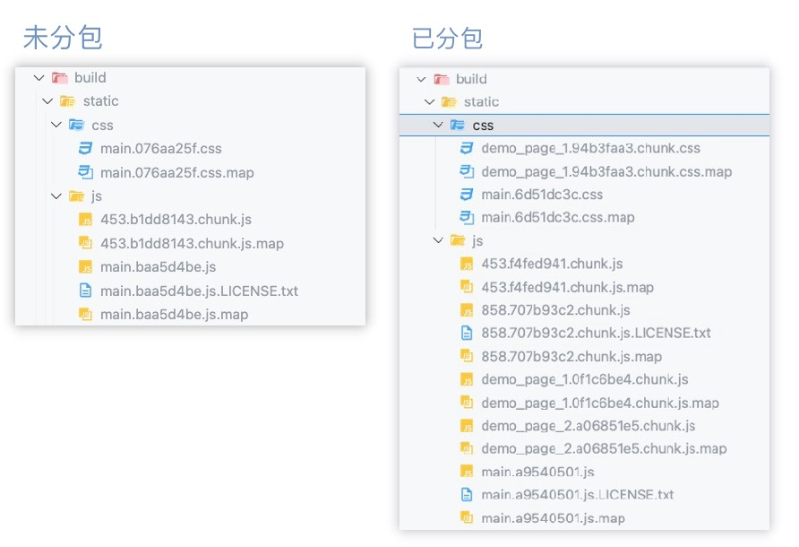

# 记录使用 create-react-app 初始项目

## 创建项目

- 使用 `create-react-app` 创建项目

```bash
npx create-react-app your-app-name --template redux-typescript
```

- 安装需要的依赖

```bash
npm install react-router-dom @types/react-router-dom antd
npm install axios -S
npm install sass -D
```

- 释放 `config`

```bash
npm run eject
```

## 配置别名

```ts title="webpack.config.ts" {2}
alias: {
  "@": path.resolve(__dirname, "../src"),
},
```

```json title="tsconfig.json" {2,3}
{
  "baseUrl": "./",
  "paths": { "@/*": ["src/*"] }
}
```

## 配置路由

```tsx title="src/index.tsx" {3,15,17}
import { createRoot } from "react-dom/client";
import reportWebVitals from "./reportWebVitals";
import { BrowserRouter } from "react-router-dom";
import { Provider } from "react-redux";
import { store } from "./app/store";
import App from "./App";

import "./index.scss";

const container = document.getElementById("root")!;
const root = createRoot(container);

root.render(
  <Provider store={store}>
    <BrowserRouter>
      <App />
    </BrowserRouter>
  </Provider>
);

// If you want to start measuring performance in your app, pass a function
// to log results (for example: reportWebVitals(console.log))
// or send to an analytics endpoint. Learn more: https://bit.ly/CRA-vitals
reportWebVitals();
```

```tsx title="src/App.tsx"
import { Navigate, Route, Routes } from "react-router-dom";
import { routersData } from "./app/config";
import Layout from "./components/layout";
import Login from "./pages/login";
import "./App.scss";

function App() {
  return (
    <Routes>
      {/* 默认重定向到 login */}
      <Route path="/" element={<Navigate to={"/login"}></Navigate>}></Route>
      {/* 登录 */}
      <Route path={routersData.login.path} element={<Login />} />
      {/* Layout 包裹 实现 Outlet */}
      <Route element={<Layout />}>
        <Route path={routersData.page1.path} element={<page1 />} />
        <Route path={routersData.page2.path} element={<page2 />} />
        <Route path={routersData.page3.path} element={<page3 />} />
      </Route>
    </Routes>
  );
}

export default App;
```

## 配置 `Axios`

- `create-react-app` 配置 `Proxy`

```json title="package.json"
  "proxy": "http://localhost:4000",
```

```ts title="http.ts"
import axios from "axios";

const instance = axios.create({
  // 处理状态码小于 500 的情况
  // status >= 200 && status < 300; // 默认值
  validateStatus: (status) => status < 500,
});

instance.interceptors.response.use(
  function (response) {
    if (response.status === 200) {
      if (response.data.code === 401) {
        // window.location.href = '/login'

        // event 发布订阅 将页面直接跳转到  /login
        // EventBus.on('global_not_login', () => {}) 接收
        EventBus.emit("global_not_login", response.data.msg);
        return Promise.reject("没有登录状态");

        // 接口错误处理
        if (response.data.code !== 0) {
          // event 发布订阅
          EventBus.emit("global_error_tips", response.data.msg);
        }
      }
    } else {
      EventBus.emit("global_error_tips", response.data.message);
    }

    return response;
  },
  function (error) {
    // console.log('发生错误',error)
    EventBus.emit("global_error_tips", error.response.data.message);
    // Any status codes that falls outside the range of 2xx cause this function to trigger
    // Do something with response error
    return Promise.reject(error);
  }
);

export type AxiosRes<T = ResData> = {
  config: Object;
  data: T;
  headers: any;
  request: any;
  status: number;
  statusText: string;
};

export type ResData<T = any> = {
  code: number;
  msg: string;
  data: T;
};

export default instance;
```

::: tip axios 可以拿到 403 请求的返回值吗？
使用 `validateStatus` 配置选项，可以自定义抛出错误的 `HTTP Code`。

```js
validateStatus: function (status) {
  return status < 500; // 处理状态码小于500的情况
}
```

使用 `toJSON` 可以获取更多关于 `HTTP` 错误的信息。

```js
axios.get("/user/12345").catch(function (error) {
  console.log(error.toJSON());
});
```

:::

## 配置 `Store`

`redux` 写起来虽然啰嗦，但是每一条状态的变化都尽在掌控。

`react` 的核心思想是 数据驱动视图，唯一数据对应唯一输出。

- createSlice

```ts title="src/store/slice/demo.ts"
import { createSlice } from "@reduxjs/toolkit";

const initialState = {};

const demoSlice = createSlice({
  initialState,
  name: "demo",
  reducers: {},
  extraReducers: (builder) => {},
});

export default demoSlice.reducer;
```

- configureStore

```tsx title="src/store/index.ts"
import { configureStore, ThunkAction, Action } from "@reduxjs/toolkit";
import { TypedUseSelectorHook, useDispatch, useSelector } from "react-redux";
import demo1Reducer from "./slice/demo1";
import demo2Reducer from "./slice/demo2";

// 类型定义
export type AppDispatch = typeof store.dispatch;
export type RootState = ReturnType<typeof store.getState>;
export type AppThunk<ReturnType = void> = ThunkAction<
  ReturnType,
  RootState,
  unknown,
  Action<string>
>;

export const store = configureStore({
  reducer: { demo1: demo1Reducer, demo2: demo2Reducer },
});

export const useAppDispatch = () => useDispatch<AppDispatch>();
export const useAppSelector: TypedUseSelectorHook<RootState> = useSelector;
```

- 一个请求示例

```ts title="src/store/slice/demo.ts"
import { createAsyncThunk, createSlice } from "@reduxjs/toolkit";
import axios, { AxiosRes, ResData } from "@/util/http";
import { RootState } from "../";

const initialState = {
  loading: false,
  source_data: [],
  select_data: null,
};

export const fetchDemoSourceData = createAsyncThunk(
  "demo/fetchDemoSourceData",
  async () => {
    const { data }: AxiosRes = await axios.get("/api/xxx/xxx");
    return data.data;
  }
);

const demoSlice = createSlice({
  initialState,
  name: "demo",
  reducers: {
    set_demo_select_data: (state, action) => {
      state.select_data = action.payload;
    },
  },
  extraReducers: (builder) => {
    builder.addCase(fetchDemoSourceData.pending, (state, action) => {
      state.loading = true;
    });
    builder.addCase(fetchDemoSourceData.fulfilled, (state, action) => {
      state.source_data = action.payload;
      state.loading = false;
    });
  },
});

export const select_demo_source_data = (state: RootState) => {
  return state.demo.source_data;
};

export const select_demo_select_data = (state: RootState) => {
  return state.demo.select_data;
};

// 返回 reducer
export const { set_demo_select_data } = demoSlice.actions;

export default demoSlice.reducer;
```

```tsx title="scr/pages/demo/index.tsx"
import { useEffect } from "react";
import styles from "./index.module.scss";
import { useAppDispatch, useAppSelector } from "@/store";
import {
  fetchDemoSourceData,
  select_demo_source_data,
  select_demo_select_data,
  set_demo_select_data,
} from "@/store/slice/demo";

function Demo() {
  const dispatch = useAppDispatch();
  const sourceData = useAppSelector(select_demo_source_data);
  const currentData = useAppSelector(select_demo_select_data);

  // 默认选中数据中的第一项
  useEffect(() => {
    dispatch(fetchDemoSourceData()).then((res) => {
      const { title, value } = res.payload[0];
      dispatch(set_demo_select_data({ value, title }));
    });
  }, []);

  // 改变时
  const handleSelectorChange = (
    value: string,
    labelList: React.ReactNode[]
  ) => {
    dispatch(set_demo_select_data({ value, title: labelList[0] }));
  };

  // ......
}

export default Demo;
```

::: tip 项目的数据流向梳理 > 组件设计
数据清晰 组件写的烂很好重构。 数据乱即使组件优雅，也没法重构。
:::

::: tip toolkit 中修改数据
一定要在 `reducer` 中去修改 `state` 的数据，不要在组件中直接改(改不成功 不支持)。

`toolkit` 底层用的 `immer`, 实际上操作的是代理对象。
:::

## 渲染错误捕捉

- ErrorBoundary

```tsx title="src/components/ErrorBoundary.tsx"
import React from "react";

class ErrorBoundary extends React.Component {
  constructor(props) {
    super(props);
    this.state = { hasError: false };
  }

  static getDerivedStateFromError(error) {
    // 更新状态，以便下一次渲染将显示后备 UI。
    return { hasError: true };
  }

  componentDidCatch(error, info) {
    // 遇到错误可以上传到服务器
    // 示例“组件堆栈”：
    // 在 ComponentThatThrows 中（由 App 创建）
    // 在 ErrorBoundary 中（由 APP 创建）
    // 在 div 中（由 APP 创建）
    // 在 App 中
    logErrorToMyService(error, info.componentStack);
  }

  render() {
    if (this.state.hasError) {
      // 你可以渲染任何自定义后备 UI
      // 比如可以提示给用户 页面发生某些请联系管理员
      return this.props.fallback;
    }

    return this.props.children;
  }
}

export default ErrorBoundary;
```

- 全局引入， 简单粗暴。
- 如果某些组件不稳定， 可以单独对这个组件进行 包装。

```tsx title="src/index.tsx" {1,6,8}
import ErrorBoundary from "@/components/ErrorBoundary";

root.render(
  <Provider store={store}>
    <BrowserRouter>
      <ErrorBoundary>
        <App />
      </ErrorBoundary>
    </BrowserRouter>
  </Provider>
);
```

## 检测渲染次数

- 自定义 hook useRenderCheck 检测组件渲染次数

```tsx title="@/hooks/useRenderCheck"
import { useRef } from "react";

function useRenderCheck(cp_name: string) {
  const ref = useRef(0);
  ref.current++;

  console.log(`${cp_name} 的渲染次数： ${ref.current}`);
}

export default useRenderCheck;
```

::: tip

- `react` 的最大的性能损耗其实就是 `render` 的调用。
- 所以确定每次 `render` 的原因 就很重要。 每一次的 `render` 都应该有正确的合理理由。
- `vue` 是自动收集依赖，自动更新。而 `react` 可以修改渲染过程。
- `redux` 的微任务 或者 同步修改 `state` 的 `render`，会被 `react` 的宏任务异步合并为一次。

:::

## 解决多次渲染

- useMemo、useCallback 结合 React.memo

```tsx title="使用 React.memo" {11}
import React from "react";

function TestMemo() {
  return (
    <div>
      <h1>this is memo</h1>
    </div>
  );
}

export default React.memo(TestMemo);
```

```tsx title="使用 useMemo、useCallback" {11}
import React from "react";

function Test() {
  const testClick = () => {};
  const memoCb = useCallback(testClick, []);
  return (
    <div>
      <TestMemo handleClick={memoCb} />
    </div>
  );
}

export default React.memo(Test);
```

::: tip
useMemo、useCallback 进行渲染次数优化，要结合 React.memo。
使用 memo 的原则，一定是你已经发现这个组件有性能问题，不要轻易使用，本身就有性能消耗。
useMemo, 和 useCallback 是优化组要接受 props 的组件。
:::

## 渲染优化

> `React` 默认开启同步渲染模式，如果某一个组件数据量以及计算量巨大，会卡住主线程，让浏览器不能渲染。

> 并发更新带来的优化，并不是把渲染速度变快，而是让 `js` 不会长期卡住主线程, 用户体验变好了。

- 使用 `useDeferredValue` 开启并发更新。可以让你延迟更新 `UI` 的某些部分。

```tsx
import { useState, useDeferredValue } from "react";

function SearchPage() {
  const [query, setQuery] = useState("");
  const deferredQuery = useDeferredValue(query);
  // ...
}
```

- 使用 `useTransition` 在不阻塞 `UI` 的情况下更新状态，将状态更新标记为非阻塞的。

```tsx
function TabContainer() {
  const [isPending, startTransition] = useTransition();
  const [tab, setTab] = useState("about");

  function selectTab(nextTab) {
    startTransition(() => {
      setTab(nextTab);
    });
  }
  // ……
}
```

::: tip useDeferredValue 和 useTransition 的区别

- `useTransition` 适合用于对 `setState` 引起的渲染进行优化。
- `useTransition` 适合数据突变。低优先级效果
- `useDeferredValue` 适合用于对 `props` 引起的渲染进行优化。
- `useDeferredValue` 适合短时间内连续数据变化的处理，它有一种类似节流的效果(节流 + 低优先级 效果)。

:::

## 分包加载

- 分包对页面进行懒加载。可以加速 `spa` 项目的加载速度。

```tsx
const AsyncDemoPage1 = lazy(
  () => import(/* webpackChunkName: "demo_page_1" */ "./pages/demo_page_1")
);
const AsyncDemoPage2 = lazy(
  () => import(/* webpackChunkName: "demo_page_2" */ "./pages/demo_page_2")
);

function DemoPage1() {
  return (
    <Suspense fallback={<div>loading...</div>}>
      <AsyncDemoPage1 />
    </Suspense>
  );
}

function DemoPage2() {
  return (
    <Suspense fallback={<div>loading...</div>}>
      <AsyncDemoPage2 />
    </Suspense>
  );
}
```

- 分包前后打包后的静态文件：



::: tip
webpack 在开发环境中 css 是通过 js 的 style 标签进行插入的，同时也方便了热更新。
但是在生产环境中 和 js 一样都可以做到异步加载。
:::

## 其他

推荐的一些好用的包：

- [events](https://www.npmjs.com/package/events)
