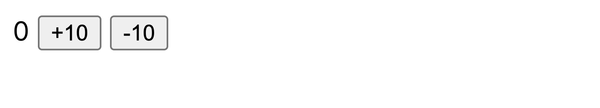
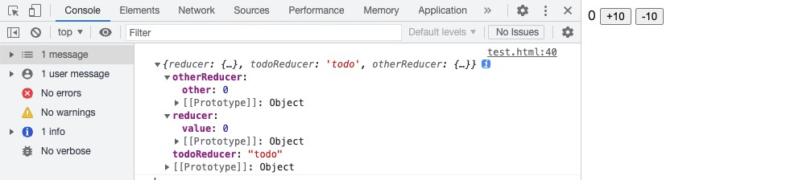
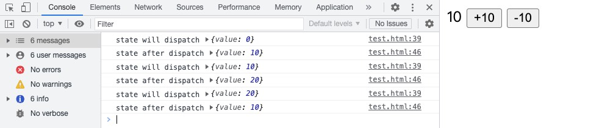
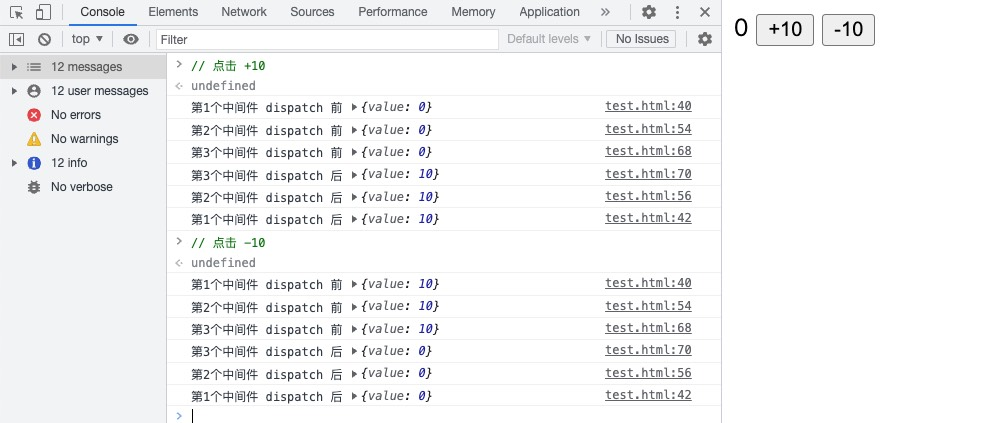

# 一杯咖啡的时间 上手 Redux & Redux Toolkit

## [Redux](https://redux.js.org/)

> Redux 是一个管理全局应用状态的库。

### 概念

#### State 管理

- 这是一个包含以下部分的 React 计数器组件：

  - state：驱动应用的真实数据源头。
  - view：基于当前状态的视图声明性描述。
  - actions：根据用户输入在应用程序中发生的事件，并触发状态更新。

  ```jsx
  function Counter() {
    // State: counter 值
    const [counter, setCounter] = useState(0);

    // Action: 当事件发生后，触发状态更新的代码
    const increment = () => {
      setCounter((prevCounter) => prevCounter + 1);
    };

    // View: 视图定义
    return (
      <div>
        Value: {counter} <button onClick={increment}>Increment</button>
      </div>
    );
  }
  ```

  - 如果当有多个组件需要共享和使用相同 `state` 时，会变得很复杂，有时可以通过 `提升 state` 到父组件解决。当组件关系复杂庞大时，这并不是一个好方法。

  - 解决这个问题的一种方法是从组件中提取共享 `state`，并将其放入组件树之外的一个集中位置。这样，我们的组件树就变成了一个大 `view`，任何组件都可以访问 `state` 或触发 `action`，无论它们在树中的哪个位置。

  - 通过定义和分离 `state` 管理中涉及的概念并强制执行维护 `view` 和 `state` 之间独立性的规则，代码变得更结构化和易于维护。

  - 这就是 `Redux` 背后的基本思想：应用中使用集中式的全局状态来管理，并明确更新状态的模式，以便让代码具有可预测性。

#### Immutability 不可变性

- "Mutable" 意为 "可改变的"，而 "immutable" 意为永不可改变。

- `Redux` 期望所有状态更新都是使用不可变的方式(Immutability)。

- `JavaScript` 的对象（object）和数组（array）默认都是 `mutable` 的:

```js
const obj = { a: 1, b: 2 };
// 对外仍然还是那个对象，但它的内容已经变了
obj.b = 3;

const arr = ["a", "b"];
// 同样的，数组的内容改变了
arr.push("c");
arr[1] = "d";
```

### Redux 术语

> `State`，`Actions`，和 `Reducers` 是 `Redux` 的构建模块。每个 `Redux` 应用都有 `state` 值，创建 `actions` 来描述发生的事情，并使用 `reducer` 函数根据之前的 `state` 和 `action` 计算新的状态值。

#### Actions

`action` 是一个带有 `type` 并且描述发生了什么的普通对象:

```js
const addTodoAction = { type: "counter/increment", payload: "ok ok" };
```

- type: 字符串。用来描述 `action`。通常写为 `域/事件名称` `feature/eventName`。
- payload: 通常用用描述发生的事情的附加信息。
- 操作应该包含描述发生的事情所需的最少数据量。

#### Reducers

`(state, action) => newState。`

`Reducers` 函数。接收当前的 `state` 和一个 `action`。通常用于决定如何更新状态，并返回新状态:

```js
const initialState = { value: 0 };

function counterReducer(state = initialState, action) {
  if (action.type === "counter/increment") {
    return { ...state, value: state.value + 1 };
  }
  return state;
}
```

Reducer 必需符合以下规则：

- 仅使用 `state` 和 `action` 参数计算新的状态值。
- 禁止直接修改 `state`。总是返回一个副本。来做 `不可变更新（immutable updates）`。
- 禁止任何异步逻辑、依赖随机值或导致其他 “副作用” 的代码。

::: warning 在 Redux 中，我们的 reducer 永远不允许改变原始/当前状态值！

```js
// ❌ 非法 - 默认情况下，这会改变状态！
state.value = 123;
```

Reducers 只能 复制 原始值，并只能改变这些副本。

```
// ✅ 做了复制，所以是安全的
return { ...state, value: 123 }
```

:::

::: tip 拆分/组合 Reducers

`Redux` 应用程序实际上只有一个 `reducer` 函数 `root reducer` 传递给 `createStore` 函数。

`Redux reducer` 通常根据更新的 `Redux state` 部分进行拆分：

```jsx
import todosReducer from "./features/todos/todosSlice";
import filtersReducer from "./features/filters/filtersSlice";

export default function rootReducer(state = {}, action) {
  // 返回一个新的根 state 对象
  return {
    // `state.todos` 的值是 todos reducer 返回的值
    todos: todosReducer(state.todos, action),
    // 对于这两个 reducer，我们只传入它们的状态 slice
    filters: filtersReducer(state.filters, action),
  };
}
```

导入并使用 combineReducers ：

`combineReducers` 接受一个对象，其中键名将成为根 `state` 对象中的键，值是描述如何更新 `Redux` 状态的 `slice reducer` 函数。

你给 `combineReducers` 的键名决定了你的状态对象的键名是什么！

```jsx
import { combineReducers } from "redux";

import todosReducer from "./features/todos/todosSlice";
import filtersReducer from "./features/filters/filtersSlice";

const rootReducer = combineReducers({
  // 定义一个名为`todos`的顶级状态字段，由`todosReducer`处理
  todos: todosReducer,
  filters: filtersReducer,
});

export default rootReducer;
```

:::

#### Store

当前 `Redux` 应用的状态存在于一个名为 `store` 的对象中。 `store` 是通过传入一个 `reducer` 来创建的。

```js
import { createStore } from "redux";
import rootReducer from "./reducer";

const store = createStore(rootReducer);

export default store;
```

- `Redux store` 汇集了构成应用程序的 `state`、`actions` 和 `reducers`:

  - 在内部保存当前应用程序 `state`
  - 通过 `store.getState()` 访问当前 `state`;
  - 通过 `store.dispatch(action)` 更新状态;
  - 通过 `store.subscribe(listener)` 注册监听器回调;
  - 通过 `store.subscribe(listener)` 返回的 unsubscribe 函数注销监听器。

- `Store enhancers` 让我们能够在创建 `store` 时进行自定义操作

  - `Enhancers` 包装了 `store` 并且可以覆盖它的方法
  - `createStore` 接受一个 `enhancer` 作为参数
  - 可以使用 `compose API` 将多个 `enhancers` 合并在一起

- `Middleware` 是自定义 `store` 的主要方式
  - 使用 `applyMiddleware enhancer` 添加 `middleware`
  - `Middleware` 被写成三个相互嵌套的函数
  - 每次 `dispatch action` 时都会运行 `middleware`
  - `Middleware` 内部可能有副作用

::: warning Redux Store
Redux 应用程序中只有一个 store。当你想要拆分数据处理逻辑时，你将使用 reducer composition 并创建多个可以组合在一起 reducer，而不是创建单独的 store。
:::

#### Dispatch

`Redux store` 有一个方法叫 `dispatch`。更新 `state` 的唯一方法是调用 `store.dispatch()` 并传入一个 `action` 对象。

```js
store.dispatch({ type: "counter/incremented" });
store.dispatch({ type: "counter/incremented", payload: "Learn about stores" });
```

`dispatch` 一个 `action` 可以形象的理解为 "触发一个事件"。每次我们调用 store.dispatch(action) 时：

- `store` 调用 `rootReducer(state, action)`。
- `store` 将新的 `state` 保存在里面。
- `store` 调用所有的监听器订阅回调。
- 监听器现在通过调用 `store.getState()` 来访问 `store` 并读取最新的 `state。`

#### Selectors

`Selector` 函数可以从 `store` 状态树中提取指定的片段。

```js
const selectCounterValue = (state) => state.value;

const currentValue = selectCounterValue(store.getState());
```

### Redux 原则

#### 单一数据源

- 应用程序的全局状态作为对象存储在单个 `store` 中。任何给定的数据片段都应仅存在于一个位置，而不是在许多位置重复。

#### State 是只读的

- 更改状态的唯一方法是 `dispatch` 一个 `action`，这是一个描述所发生事件的对象。

#### 使用 Reducer 纯函数进行更改

- 若要指定如何基于 `action` 更新状态树，请编写 `reducer` 函数。
- 与任何其他函数一样，你可以将 `Reducer` 拆分为较小的函数以帮助完成工作，或者为常见任务编写可重用的 `Reducer`。

### Redux 数据流

#### 单向数据流（one-way data flow）

- 用 `state` 来描述应用程序在特定时间点的状况。
- 基于 `state` 来渲染出 `View`。
- 当发生某些事情时（例如用户单击按钮），`state` 会根据发生的事情进行更新，生成新的 `state`。
- 基于新的 `state` 重新渲染 `View`。


#### Redux 数据流

Redux 使用 "单向数据流"，可以将这些步骤分解为更详细的内容：

- 初始启动：

  - 使用最顶层的 `root reducer` 函数创建 `Redux store`
  - `store` 调用一次 `root reducer`，并将返回值保存为它的初始 `state`
  - 当 `UI` 首次渲染时，`UI` 组件访问 `Redux store` 的当前 `state`，并使用该数据来决定要呈现的内容。
  - 同时监听 `store` 的更新，以便他们可以知道 `state` 是否已更改。

- 更新环节：
  - 应用程序中发生了某些事情，例如用户单击按钮
  - `dispatch` 一个 `action` 到 `Redux store`，例如 `dispatch({type: 'counter/increment'})`
  - `store` 用之前的 `state` 和当前的 `action` 再次运行 `reducer` 函数，并将返回值保存为新的 `state`
  - `store` 通知所有订阅过的 `UI`，通知它们 `store` 发生更新
  - 每个订阅过 `store` 数据的 `UI` 组件都会检查它们需要的 `state` 部分是否被更新。
  - 发现数据被更新的每个组件都强制使用新数据重新渲染，紧接着更新网页。


```html title="代码实现"
<body>
  <div>
    <span id="value">0</span>
    <button id="increment">+10</button>
    <button id="decrement">-10</button>
  </div>
  <script type="module">
    import { createStore } from "https://unpkg.com/redux@latest/dist/redux.browser.mjs";

    // 定义State： 定义一个初始状态值
    const initialSate = { value: 0 };

    // 定义Reducer： 参数接收 state(初始值initialSate) 和 action
    const reducer = (state = initialSate, action) => {
      // / Reducers 通常会查看发生的 action 的 type 来决定如何更新状态
      switch (action.type) {
        case "counter/incremented":
          return { value: state.value + 10 };
        case "counter/decremented":
          return { value: state.value - 10 };
        default:
          return state;
      }
    };

    // 创建Store：调用 Redux 库 createStore 来创建一个 store 实例
    // createStore 会执行一次 reducer，对 state 进行初始化
    const store = createStore(reducer);

    // 获取 HTML 元素
    const valueEl = document.getElementById("value");

    // 获取 Store 状态并更新 UI
    function render() {
      const state = store.getState();
      valueEl.innerHTML = state.value.toString();
    }

    // 初始化调用 更新 UI
    render();

    // 订阅 Store 的状态
    store.subscribe(render);

    // 点击按钮时 发起 action
    document.getElementById("increment").addEventListener("click", function () {
      store.dispatch({ type: "counter/incremented" });
    });

    document.getElementById("decrement").addEventListener("click", function () {
      store.dispatch({ type: "counter/decremented" });
    });
  </script>
</body>
```



## [Redux Toolkit](https://redux-toolkit.js.org/)

> 官方推荐的编写 Redux 逻辑的方法（最佳实践）也称为 "RTK"。

::: tip 为什么要用 redux-toolkit 而不是 redux

- 配置一个 Redux store 过于复杂。
- Redux Toolkit (RTK) 是编写 Redux 逻辑的标准方式。
- Redux 需要太多的样板代码。
- 围绕 Redux 核心，并包含其他有用的包.

:::

### configureStore

- `configureStore` 用来设置一个具有良好默认值的 `Redux store`。

- `Redux Toolkit` 的 `configureStore API`，可简化 `store` 的设置过程。

- `toolkit` 其实只是对 `redux` 进行了封装，实际上 `store` 和 `redux` 中的是一样的。

```jsx
import { configureStore } from "@reduxjs/toolkit";

import todosReucer from "./features/todos/todosSlice";
import filtersReducer from "./features/filters/filtersSlice";

const store = configureStore({
  reducer: {
    // 定义一个名为 `todos` 的顶级 state 字段，值为 `todosReducer`
    todos: todosReducer,
    filters: filtersReducer,
  },
});

export default store;
```

`configureStore` 为我们完成了所有工作：

- 自动组合 slice reducers 来创建根 reducer
- 自动添加更多 `middleware` 来检查常见错误，例如意外改变`（mutate）state`
- 自动设置 `Redux DevTools` 扩展连接

### createSlice

- `createSlice` 简化了 `Redux actions` 和 `reducers` 的编写

- 根据 `slice/reducer` 名称自动生成 `action creators`

- `Reducers` 可以使用 `Immer` 在 `createSlice` 中 `“改变”（mutate）state`

```jsx
import { createSlice } from "@reduxjs/toolkit";

const initialState = {
  entities: [],
  status: null,
};

const todosSlice = createSlice({
  name: "todos",
  initialState,
  reducers: {
    todoAdded(state, action) {
      // ✅ “突变”（mutate）代码在 createSlice 中是可以的！
      state.entities.push(action.payload);
    },
    todoToggled(state, action) {
      const todo = state.entities.find((todo) => todo.id === action.payload);
      todo.completed = !todo.completed;
    },
    todosLoading(state, action) {
      return {
        ...state,
        status: "loading",
      };
    },
  },
});

export const { todoAdded, todoToggled, todosLoading } = todosSlice.actions;

export default todosSlice.reducer;
```

- `createSlice` 接收一个包含三个主要选项字段的对象：
  - `name`：一个字符串，将用作生成的 `action types` 的前缀
  - `initialState`：`reducer` 的初始 `state`
  - `reducers`：一个对象，其中键是字符串，值是处理特定 `actions` 的 `case reducer` 函数

### createAsyncThunk

- `createAsyncThunk` 为异步调用生成 `thunk`

  - `dispatch thunk` 运行 `payload creator` 并 `dispatch actions`
  - 可以在 `createSlice.extraReducers` 中处理 `thunk actions`

- `createAsyncThunk` 接收两个参数：
  - 一个字符串，用作生成的 `action types` 的前缀
  - 一个 `payload creator` 回调函数，应该返回一个 `Promise`。这通常使用 `async/await` 语法编写，因为 `async` 函数会自动返回一个 `Promise`。

```jsx
import { createSlice, createAsyncThunk } from "@reduxjs/toolkit";
// 省略 imports 和 state

export const fetchTodos = createAsyncThunk("todos/fetchTodos", async () => {
  const response = await client.get("/fakeApi/todos");
  return response.todos;
});

const todosSlice = createSlice({
  name: "todos",
  initialState,
  reducers: {
    // 省略 reducer cases
  },
  extraReducers: (builder) => {
    builder
      .addCase(fetchTodos.pending, (state, action) => {
        state.status = "loading";
      })
      .addCase(fetchTodos.fulfilled, (state, action) => {
        const newEntities = {};
        action.payload.forEach((todo) => {
          newEntities[todo.id] = todo;
        });
        state.entities = newEntities;
        state.status = "idle";
      });
  },
});

// 省略 exports
```

### createEntityAdapter

`createEntityAdapter` 为标准化 `state` 提供了 `reducers + selectors`

- 自动生成一个 `thunk + pending/fulfilled/rejected action creators`
- 包括用于常见任务的 `reducer` 功能，例如添加/更新/删除 `items`
- 为 `selectAll` 和 `selectById` 生成记忆化 `selectors`

## [Redux](https://redux.js.org/) 内部实现

Redux 的 API 非常少。Redux 为你定义了一系列的约定（例如 reducers），同时提供了少量的辅助函数来把这些约定整合到一起。

- 顶级暴露的方法：

  - `createStore(reducer, [preloadedState], [enhancer])`
  - `combineReducers(reducers)`
  - `applyMiddleware(...middlewares)`
  - `bindActionCreators(actionCreators, dispatch)`
  - `compose(...functions)`。

- Store API：
  - `getState()`
  - `dispatch(action)`
  - `subscribe(listener)`
  - `replaceReducer(nextReducer)`

以下代码实现的测试都基于该计数器代码：

```html title="redux-learn.html"
<!DOCTYPE html>
<html>
  <head>
    <title>Redux basic example</title>
  </head>

  <body>
    <div>
      <span id="value">0</span>
      <button id="increment">+10</button>
      <button id="decrement">-10</button>
    </div>
    <script type="module">
      import { createStore } from "https://unpkg.com/redux@latest/dist/redux.browser.mjs";

      // 定义State： 定义一个初始状态值
      const initialSate = { value: 0 };

      // 定义Reducer： 参数接收 state(初始值initialSate) 和 action
      const reducer = (state = initialSate, action) => {
        // / Reducers 通常会查看发生的 action 的 type 来决定如何更新状态
        switch (action.type) {
          case "counter/incremented":
            return { value: state.value + 10 };
          case "counter/decremented":
            return { value: state.value - 10 };
          default:
            return state;
        }
      };

      // 创建Store：调用 Redux 库 createStore 来创建一个 store 实例
      const store = createStore(reducer);

      // 获取 HTML 元素
      const valueEl = document.getElementById("value");

      // 获取 Store 状态并更新 UI
      function render() {
        const state = store.getState();
        valueEl.innerHTML = state.value.toString();
      }

      // 初始化调用 更新 UI
      render();

      // 订阅 Store 的状态
      store.subscribe(render);

      // 点击按钮时 发起 action
      document
        .getElementById("increment")
        .addEventListener("click", function () {
          store.dispatch({ type: "counter/incremented" });
        });

      document
        .getElementById("decrement")
        .addEventListener("click", function () {
          store.dispatch({ type: "counter/decremented" });
        });
    </script>
  </body>
</html>
```

### 实现 `createStore`

- `store` 内部有当前的 `state`
- `getState` 方法返回当前 `state` 值
- `dispatch` 调用 `reducer`，保存 `state`，并运行监听器
- `store` 在启动时 `dispatch` 一个 `action` 来初始化 `reducers` 的 `state`
- `store API` 是一个对象，里面有 { `dispatch`, `subscribe`, `getState` }

```js title="redux-learn.js"
function createStore(reducer) {
  // store 内部 state 值
  let state;

  // store 内部保存监听器集合
  let listerners = [];

  // `getState` 方法返回当前 `state` 值
  function getState() {
    return state;
  }

  // dispatch 调用 reducer，保存 新的 state。
  // dispatch 运行 subscribe 订阅的 集合中 所有函数
  function dispatch(action) {
    state = reducer(state, action);
    listerners.forEach((listerner) => listerner());
  }

  // subscribe 用来 订阅 发布函数，可以多个订阅放入集合中。
  function subscribe(listener) {
    listerners.push(listener);
  }

  // 内部启动时触发一次 dispatch
  dispatch({ type: "@@redux/init" });

  const store = { getState, dispatch, subscribe };

  // 返回 { dispatch, subscribe, `getState }
  return store;
}
```

- 测试：

```html title="redux-learn.html" {4,7}
<!-- ... 省略以上代码 ... -->

<!-- 引入自己实现的 createStore -->
<script src="./redux-test.js"></script>
<script type="module">
  // 使用 redux-test.js 中的 createStore
  // import { createStore } from "https://unpkg.com/redux@latest/dist/redux.browser.mjs";

  // ... 以下省略代码 ...
</script>
<!-- ... 省略以下代码 ... -->
```

### 实现 combineReducers

- `combineReducers` 就是把多个 `reducer` ，合并成一个 `reducer` 函数，传递给 `createStore`使用。
- 参数：一个 `reducers` 对象，对象的 `value` 对应不同的 `reducer`。
- 返回：调用了 `reducers` 对象里所有 `reducer` 后的一个 `reducer` 函数，并且构造一个与 `reducers` 对象结构相同的 `state` 对象。

```js title="redux-learn.js"
function combineReducers(reducers) {
  // 获取传入对象的所有 key
  const reducersKeys = Object.keys(reducers);

  // 返回的一个reducer createStore 就接受一个 reducer 函数
  const finalReducer = (state = {}, action) => {
    const finalState = {};
    // 遍历执行 reducers 中 所有的 reducer
    for (let i = 0; i < reducersKeys.length; i++) {
      // 当前key
      const key = reducersKeys[i];
      // 当前的 reducer
      const currentReducer = reducers[key];
      // 执行当前的 reducer 传入 finalReducer 的参数
      const currentState = currentReducer(state[key], action);
      // 利用传入的对象结构 构造一个结构相同的新 state 返回
      finalState[key] = currentState;
    }
    return finalState;
  };

  return finalReducer;
}
```

- 测试：

```js title="redux-learn.html"
// ... 省略以上代码 ...

// 定义State： 定义一个初始状态值
const initialSate = { value: 0 };

// 定义Reducer： 参数接收 state(初始值initialSate) 和 action
const reducer = (state = initialSate, action) => {
  // / Reducers 通常会查看发生的 action 的 type 来决定如何更新状态
  switch (action.type) {
    case "counter/incremented":
      return { value: state.value + 10 };
    case "counter/decremented":
      return { value: state.value - 10 };
    default:
      return state;
  }
};

// 测试 combineReducers
const todoReducer = (state = "todo", action) => {
  return state;
};
const otherReducer = (state = { other: 0 }, action) => {
  return state;
};

// 创建Store：调用 Redux 库 createStore 并使用 combineReducers 来创建一个 store 实例
const store = createStore(
  combineReducers({ reducer, todoReducer, otherReducer })
);

console.log(store.getState());

// ... 省略以下代码 ...
```



### 实现 applyMiddleware

`middleware` 中间件 是什么：

- `middleware` 是自定义 `store` 的主要方式。
- `middleware` 中间件是让我们自定义 `dispatch` 的函数。
- `middleware` 在 `dispatch action` 和 `reducer` 之间提供扩展点。一般用来进行日志记录、崩溃报告、异步 API 通信、路由等。
- `middleware` 被写成三个相互嵌套的函数 每次 `dispatch action` 时都会运行 `middleware`。
- 自定义 `middleware` 示例：

```js title="redux-learn.html"
// 外层 function:
function logger(storeAPI) {
  return function wrapDispatch(next) {
    return function handleAction(action) {
      console.log("will dispatch", action);

      // 调用 middleware 链中下一个 middleware 的 dispatch。
      // 或者使用 storeAPI.dispatch(action) 重启管线
      const returnValue = next(action);

      // 这里也可以使用 storeAPI.getState()
      console.log("state after dispatch", storeAPI.getState());

      // 一般会是 action 本身，除非后面的 middleware 修改了它。
      return returnValue;
    };
  };
}

// 使用箭头函数：
const anotherLogger = (storeAPI) => (next) => (action) => {
  // 当每个 action 都被 dispatch 时，在这里做一些事情
  return next(action);
};
```

`applyMiddleware` 是什么：

- `Middleware` 并不需要和 `createStore` 绑在一起使用，也不是 `Redux` 架构的基础组成部分。
- 但它带来的益处让官方认为有必要在 `Redux` 核心中包含对它的支持。
- 虽然不同的 `middleware` 可能在易用性和用法上有所不同，它仍被作为扩展 `dispatch` 的唯一标准的方式。
- 参数: 遵循 `Redux middleware API` 的函数。
- 返回: 一个应用了 `middleware` 后的 `store enhancer`。
- 实现 `applyMiddleware`：

```js title="redux-learn.js"
// 首先 createStore 接收一个 enhancer 函数
function createStore(reducer, enhancer) {
  // 如果 传入 enhancer, 返回一个 新的 store
  if (enhancer && typeof enhancer === "function") {
    const newCreateStore = enhancer(createStore);
    const newStore = newCreateStore(reducer);
    return newStore;
  }
  // ... 省略以下代码 ...
}

// 定义 applyMiddleware 接收 middleware
function applyMiddleware(middleware) {
  // 定义 enhancer 接收一个创建 store 的方法 并返回一个 newCreateStore
  function enhancer(createStore) {
    // 定义 newCreateStore 接收 reducer

    function newCreateStore(reducer) {
      // 使用 createStore 创建 store
      const store = createStore(reducer);
      // 把这个 store 传递给 middleware，也就是测试代码中的 logger的参数

      // 这里开始处理 中间件：调用 middleware 传递当前的 store，返回 wrapDispatch
      const wrapDispatch = middleware(store);
      // wrapDispatch 接收当前的 store 的 dispatch，并返回一个 新的 dispatch
      const newDispatch = wrapDispatch(store.dispatch);

      // 重写 store 的 dispatch 并返回
      return { ...store, dispatch: newDispatch };
    }

    // enhancer 返回一个 newCreateStore
    return newCreateStore;
  }
  // applyMiddleware 返回一个 enhancer
  return enhancer;
}
```

- 测试 `applyMiddleware`：

```js title="redux-learn.html"
// ... 省略以上代码 ...

// logger middleware
function logger(storeAPI) {
  return function wrapDispatch(next) {
    return function handleAction(action) {
      console.log("state will dispatch", storeAPI.getState());

      // 调用 middleware 链中下一个 middleware 的 dispatch。
      const returnValue = next(action);

      // 这里也可以使用 storeAPI.getState()
      // 或者使用 storeAPI.dispatch(action) 重启管线
      console.log("state after dispatch", storeAPI.getState());

      // 一般会是 action 本身，除非后面的 middleware 修改了它。
      return returnValue;
    };
  };
}

// 测试 applyMiddleware
const store = createStore(reducer, applyMiddleware(logger));

// ... 省略以下代码 ...
```

- 每次 `dispatch action` 时都会运行 `middleware`：



### 实现 compose

- 想要使用多个 `store enhancer`，可以使用 `compose()` 方法：

```js title="例"
// applyMiddleware 中的连续调用：
const store = createStore(
  reducer,
  applyMiddleware(middleware1, middleware2, middleware3)
);
//  或: 这个 store 与 applyMiddleware 和 redux-devtools 一起使用:
const store = createStore(
  reducer,
  compose(applyMiddleware(thunk), DevTools.instrument())
);
```

- 用来从右到左来组合多个函数。
- 参数：需要合成的多个函数。预计每个函数都接收一个参数。它的返回值将作为一个参数提供给它左边的函数，以此类推。
- 返回：从右到左把接收到的函数合成后的最终函数。
- 函数式编程思想，Redux 中应用很多。
- compose(funcA, funcB, funcC) 形象为 compose(funcA(funcB(funcC())))。
- 实现 `compose`：

```js title="redux-learn.js"
// 定义 compose 函数 接收 需要合成的多个函数
function compose() {
  // 接收 函数参数
  const funs = [].slice.apply(arguments);

  // 接收一个参数 返回一个 从右到左把接收到的函数合成后的最终函数
  return function (arg) {
    // Array.prototype.reduceRight()
    return funs.reduceRight((preFunRes, funItem) => {
      return funItem(preFunRes);
    }, arg);
  };
}
```

- 改写 `applyMiddleware` 支持 多个中间件：

```js title="redux-learn.js" {12,13,18-21}
// before : function applyMiddleware(middleware) {
// after: 这里 接收 middlewares
function applyMiddleware(...middlewares) {
  function enhancer(createStore) {
    function newCreateStore(reducer) {
      const store = createStore(reducer);

      // before: 这里开始处理 中间件：调用 middleware 传递当前的 store，返回 wrapDispatch
      // before: const wrapDispatch = middleware(store);

      // after: 循环调用 每个 middleware 并获得返回的 wrapDispatch 队列
      const wrapDispatchChain = middlewares.map((item) => item(store));

      // befroe: wrapDispatch 接收当前的 store 的 dispatch，并返回一个 新的 dispatch
      // before: const newDispatch = wrapDispatch.(store.dispatch);

      // after: 使用 compose 从右到左把 wrapDispatchChain 队列中函数 合成最终函数
      // after: wrapDispatch 接收当前的 store 的 dispatch，并返回一个 新的 dispatch
      const wrapDispatchCompose = compose(...wrapDispatchChain);
      const newDispatch = wrapDispatchCompose(store.dispatch);

      return { ...store, dispatch: newDispatch };
    }
    return newCreateStore;
  }
  return enhancer;
}
```

- 测试 `applyMiddleware`：

```js title="redux-learn.html" {46}
// ... 省略以上代码 ...

// 第一个中间件
function middleware1({ getState }) {
  return function wrapDispatch(next) {
    return function handleAction(action) {
      console.log("第1个中间件 dispatch 前", getState());
      const returnValue = next(action);
      console.log("第1个中间件 dispatch 后", getState());

      return returnValue;
    };
  };
}

// 第二个中间件
function middleware2({ getState }) {
  return function wrapDispatch(next) {
    return function handleAction(action) {
      console.log("第2个中间件 dispatch 前", getState());
      const returnValue = next(action);
      console.log("第2个中间件 dispatch 后", getState());

      return returnValue;
    };
  };
}

// 第三个中间件
function middleware3({ getState }) {
  return function wrapDispatch(next) {
    return function handleAction(action) {
      console.log("第3个中间件 dispatch 前", getState());
      const returnValue = next(action);
      console.log("第3个中间件 dispatch 后", getState());

      return returnValue;
    };
  };
}

// 测试 applyMiddleware
const store = createStore(
  reducer,
  applyMiddleware(middleware1, middleware2, middleware3)
);

// ... 省略以下代码 ...
```


