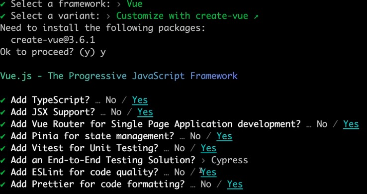
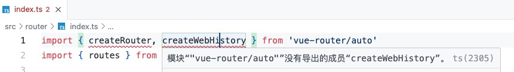
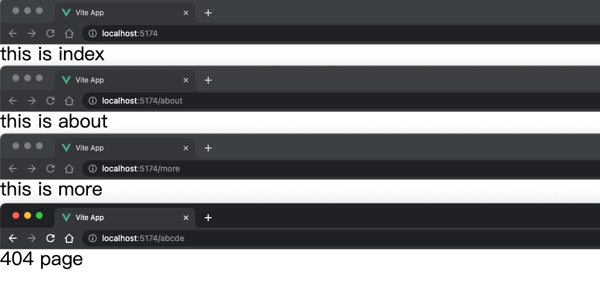

# 创建并初始化 Vue3 前端项目

## 创建项目

[vite](https://cn.vite.dev/) 创建项目:

```bash
pnpm create vite youyou-vue3-template
```



安装项目依赖:

```bash
cd youyou-vue3-template
pnpm install
```

删除不必要的文件:

```bash

rm -rf src/components/icons

rm src/components/HelloWorld.vue src/components/TheWelcome.vue src/components/WelcomeItem.vue

rm src/views/AboutView.vue src/stores/counter.ts src/assets/base.css
```

修改默认文件代码如下:

- 1. 清空 `src/assets/main.css`：
- 2. 修改 `src/views/HomeView.vue` ：
- 3. 修改 `src/router/index.ts` ：
- 4. 修改 `src/views/App.vue` ：

::: code-group

```vue [HomeView.vue]
<template>
  <main>this is home view</main>
</template>
```

```ts [index.ts]
import { createRouter, createWebHistory } from "vue-router";
import HomeView from "../views/HomeView.vue";

const router = createRouter({
  history: createWebHistory(import.meta.env.BASE_URL),
  routes: [
    {
      path: "/",
      name: "home",
      component: HomeView,
    },
  ],
});

export default router;
```

```vue [App.vue]
<script setup lang="ts">
import { RouterView } from "vue-router";
</script>

<template>
  <RouterView />
</template>
```

```css [main.css]
/** this is main.css */
```

:::

安装并引入 [reset-css](https://www.npmjs.com/package/reset-css) 重置默认样式:

```bash
pnpm install reset-css
```

::: code-group

```ts{9} [src/main.ts]
import './assets/main.css'
import { createApp } from 'vue'
import { createPinia } from 'pinia'
import router from './router'
import App from './App.vue'

import 'reset-css' // [!code focus]

const app = createApp(App)
app.use(createPinia())
app.use(router)
app.mount('#app')
```

:::

使用 `pnpm dev` 运行项目即可。

::: tip
除了 [reset.css](https://www.npmjs.com/package/reset-css) 外，还有很多类似的库，比如 [normalize.css](https://necolas.github.io/normalize.css/)，自行选择。
:::

## 路由方案

这里采用自动路由方案：[unplugin-vue-router](https://github.com/posva/unplugin-vue-router)

手动路由：路由配置文件会非常冗长、配置文件难以维护。 (约定大于配置？)

自动路由：是指通过一定的配置和工具，实现路由的自动生成，而无需手动编写每个路由的配置。这种方案可以显著提高开发效率，减少人为错误，并使得项目的路由管理更加清晰和可维护。

::: tip

[unplugin-vue-router](https://github.com/posva/unplugin-vue-router) 是一个构建时的插件，能够基于 Vue 组件文件自动生成路由配置。

[vite-plugin-pages](https://github.com/hannoeru/vite-plugin-pages) 也是基于文件系统的路由生成方案。它为 vite 而设计，其他场景不适用。

:::

安装 `unplugin-vue-router` 插件：

```bash
pnpm install -D unplugin-vue-router
```

在 `vite.config.ts` 中配置 `unplugin-vue-router`：

::: code-group

```ts{9,13} [vite.config.ts]
import { fileURLToPath, URL } from "node:url";

import { defineConfig } from "vite";
import vue from "@vitejs/plugin-vue";
import vueJsx from "@vitejs/plugin-vue-jsx";
import vueDevTools from "vite-plugin-vue-devtools";

// 引入 unplugin-vue-router/vite
import VueRouter from "unplugin-vue-router/vite"; // [!code focus]

export default defineConfig({
  plugins: [
    VueRouter({ routesFolder: 'src/views' }), // [!code focus]
    vue(), // Vue() 必须放在 VueRouter() 之后 // [!code focus]
    vueJsx(),
    vueDevTools(),
  ],
  resolve: {
    alias: {
      "@": fileURLToPath(new URL("./src", import.meta.url)),
    },
  },
});
```

:::

::: tip [routesFolder](https://uvr.esm.is/guide/file-based-routing.html#custom-extensions)
默认情况下，`unplugin-vue-router` 插件会检查文件夹 `src/pages` 中 `.vue` 文件，并根据文件名生成相应的路由结构。
这里通过添加 `routesFolder` 来配置它。
:::

::: warning
Vite 在使用插件时有顺序要求。Vue 的插件一定要在 VueRouter 的后面进行注册配置。
:::

在 `router.ts` 中配置 `vue-router/auto` :

::: code-group

```ts {1,2,6} [src/router/index.ts]
import { createRouter, createWebHistory } from "vue-router/auto"; // [!code focus]
import { routes } from "vue-router/auto-routes"; // [!code focus]

const router = createRouter({
  history: createWebHistory(import.meta.env.BASE_URL),
  routes, // [!code focus]
});

export default router;
```

:::

::: warning 模块“"vue-router/auto"”没有导出的成员“createRouter”。。

如果你遇到了这个问题：



这里按照文档方式来处理一下：[传送](https://github.com/posva/unplugin-vue-router?tab=readme-ov-file#setup)

我这里向 `env.d.ts` 文件中添加类型：

```ts{2}
/// <reference types="vite/client" />
/// <reference types="unplugin-vue-router/client" /> // [!code focus]
```

:::

配置捕获所有 `(Catch-All)`，来引导 `404` 没有找到的路由：

> 当你使用自动路由方案（如通过 unplugin-vue-router 插件或其他类似工具）时，创建一个捕获所有（catch-all）或 404 未找到（Not Found）路由的功能变得非常简便。

::: tip [官方文档](https://uvr.esm.is/guide/file-based-routing.html#catch-all-404-not-found-route)

要创建 `Catch-All`，请在名称前添加 `...`，例如 `src/pages/[...path].vue` 将创建具有以下路径的路由：`/:path(.*)`。这将匹配任何路由。这也可以在文件夹内完成，例如 `src/pages/articles/[...path].vue` 将创建具有以下路径的路由：`/articles/:path(.*)`。

:::

在 `src/views/` 中新增 `[...all].vue`:

::: code-group

```vue [src/views/[...all].vue]
<template>
  <div>404 page</div>
</template>
```

:::

多创建几个文件来测试自动路由效果：

::: code-group

```vue [src/views/index.vue]
<template>
  <div>this is index</div>
</template>
```

```vue [src/views/about.vue]
<template>
  <div>this is about</div>
</template>
```

```vue [src/views/more.vue]
<template>
  <div>this is more</div>
</template>
```

:::



## CSS 方案

## 图标方案
