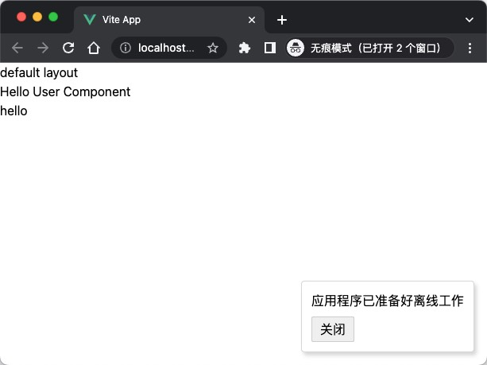
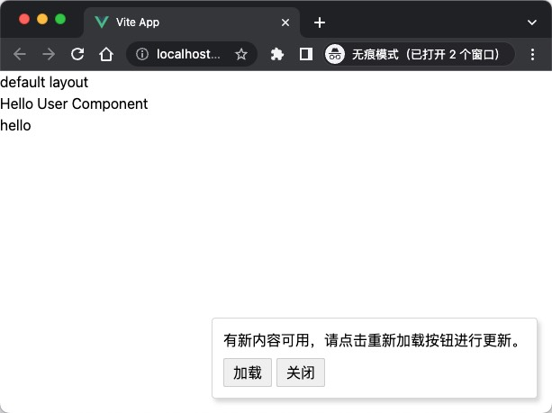
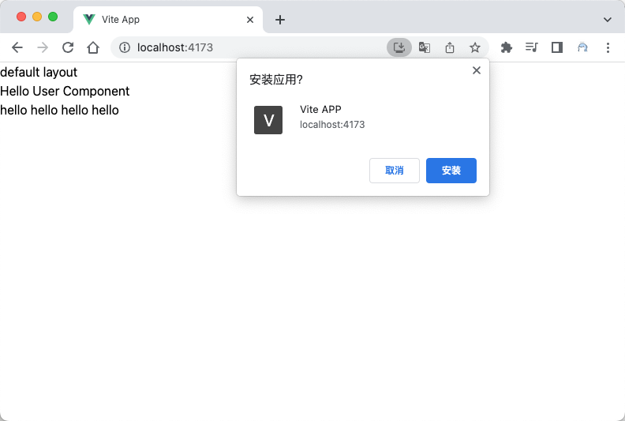
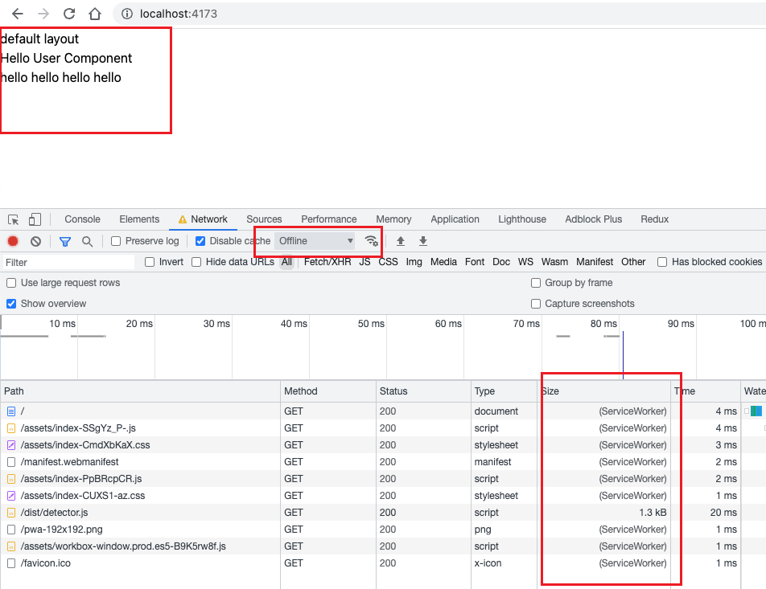

# 渐进式 Web 应用（PWA）技术集成

## 渐进式 Web 应用

> 以下资料来自： [web.dev](https://web.dev/learn/pwa)。

渐进式 `Web` 应用 `(PWA)` ，它使用渐进式增强功能为用户提供更可靠的体验，使用新功能提供更集成的体验，并且可以安装。

由于它是一款 `Web` 应用，因此只需一个代码库，即可让任何人随时随地通过任何设备访问。 安装后，`PWA` 看起来就像任何其他应用，具体而言：

- 它在主屏幕、应用启动器、启动板或开始菜单上都有图标。
- 当您在设备上搜索应用时，此图标会显示。
- 此类广告会在一个独立的窗口中打开，该窗口完全独立于浏览器的界面。
- 它可以与操作系统进行更高级别的集成，例如网址处理或标题栏自定义。
- 离线时也能使用。

### Web 平台

`Web` 应用可以通过单个代码库面向任何人、在任何位置、通过任何设备提供服务。

对于开发者而言，`Web` 还提供了透明且简单明了的部署机制。无需打包，无需额外的内容审核，也不会延迟更新。 用户访问您的应用时，始终会获得最新版本。

`Web` 应用现在借助 新功能和新技术 支持用户在离线状态下进行互动或查看内容。

### 平台专用应用

移动设备和桌面设备上的平台专用应用以功能丰富且可靠著称。它们会一直出现在主屏幕、任务栏中。

无论网络连接如何，它们都可以运行，并且以独立方式启动。

它们可以从本地文件系统中读取和写入文件，访问通过 USB、串行或蓝牙连接的硬件，以及与存储在设备上的数据（例如联系人和日历活动）互动。在平台专用应用中，您可以在其他应用中拍照、播放主屏幕上列出的歌曲，或控制媒体播放。这些应用给人的感觉就像是其所运行设备的一部分。

特定于平台的应用面临的一个挑战是，它们与多个平台和设备不兼容，因此，如果不从头开始创建新应用，将 `Android` 应用移植到 `iOS` 或将 `iOS` 应用移植到 `Windows` 或 `ChromeOS` 并不容易。

### 两全其美

如果从功能和覆盖面方面考虑平台应用和 `Web` 应用，平台应用代表了最出色的功能，而 `Web` 应用代表了最广泛的覆盖面。渐进式 `Web` 应用集平台应用的功能和 `Web` 应用的覆盖面于一体。 渐进式网页应用包含这两者的功能。

| Web              | Platform apps |
| ---------------- | :-----------: |
| 可关联性         |   支持离线    |
| 默认可访问       |    高性能     |
| 无处不在         |   设备集成    |
| 易于部署         |   独立体验    |
| 易于更新         | “已安装”图标  |
| 所有人都可以发布 |  丰富且可靠   |

### 优势与应用场景

优势：

- 无需下载和安装：用户可以直接在浏览器中访问 `PWA`，无需像原生应用那样进行繁琐的下载和安装过程。
- 跨平台兼容：`PWA` 可以在各种设备和浏览器上运行，无需针对不同平台进行开发。
- 离线支持：通过 `Service Workers` 的缓存功能，`PWA` 可以在无网络情况下提供服务。
- 更新方便：`PWA` 的更新是通过服务器推送的，用户无需手动更新应用程序。

应用场景：

- 典型的 `PWA` 应用： [Github CodeSpace](https://github.com/codespaces)
- `PWA` 适用于各种场景，如流媒体、云游戏、远程计算等。
- 无论是哪种应用程序，`PWA` 都可以提供更好的用户体验，增加用户留存率，并提高应用程序的可发现性。

## Service Workers

> 用户希望应用在网络连接速度较慢或不稳定时能够可靠地启动，或者 即使离线也无妨。他们希望看到最近互动过的内容 （例如媒体曲目）必须可供使用。

- `Service Workers` 是 `PWA` 的核心组件之一，它允许应用程序在后台运行，以便缓存必要的资源并提供离线支持。
- `Service Workers` 可以拦截 `HTTP` 请求，检查请求的资源是否在缓存中存在，如果存在则直接从缓存中调用，即使在网络不可用时也能提供服务。
- `Service Workers` 还可以处理功能性事件，如 `fetch（请求）`、`sync（后台同步）`等。

## WebApp Manifest

- `WebApp Manifest` 是一个基于 `JSON` 的文件，它定义了 `PWA` 的一些基本信息和特性。
- 通过 ` WebApp Manifest`，`PWA` 可以在移动设备的主屏上添加一个快捷方式，方便用户快速访问。
- `WebApp Manifest` 还可以控制应用程序的启动画面、屏幕方向、图标等内容。

## PWA 集成到项目

> `Vite PWA` 可以帮助您将现有的应用程序转换为 `PWA`，而无需进行太多的配置。它预设了适用于常见场景的合理默认值。

[vite-plugin-pwa](https://github.com/vite-pwa/vite-plugin-pwa) 插件能够:

- 生成 `web application manifest` 并且添加到程序入口。
- 使用 `strategies` 选项，生成 `service worker`。
- 生成脚本在浏览器中注册 `service worker`。

### 配置 Vite Pwa

安装配置[vite-plugin-pwa](https://github.com/vite-pwa/vite-plugin-pwa)

::: code-group

```sh [pnpm]
pnpm add -D vite-plugin-pwa
```

:::

::: code-group

```ts [vite.config.ts]
import { VitePWA } from "vite-plugin-pwa";

export default {
  plugins: [VitePWA()],
};
```

:::

注册 `Service Worker`

如果你配置了 `injectRegister`, `vite-plugin-pwa` 插件将自动为您注册 `service worker`。

::: code-group

```ts [vite.config.ts]
import { VitePWA } from "vite-plugin-pwa";

export default defineConfig({
  plugins: [
    VitePWA({
      injectRegister: "auto",
    }),
  ],
});
```

:::

> 更多配置阅读 [文档](https://vite-pwa-org-zh.netlify.app/guide/register-service-worker.html#%E6%B3%A8%E5%86%8C-service-worker)

对于 `Vue 3` 你可以使用 `Vite` 内置的虚拟模块 `virtual:pwa-register/vue`:

新建一个 `ReloadPrompt.vue` 组件 来实践一下:

::: code-group

```vue [src/components/ReloadPrompt.vue]
<script setup lang="ts">
import { useRegisterSW } from "virtual:pwa-register/vue";

const { offlineReady, needRefresh, updateServiceWorker } = useRegisterSW();

async function close() {
  offlineReady.value = false;
  needRefresh.value = false;
}
</script>

<template>
  <div v-if="offlineReady || needRefresh" class="pwa-toast" role="alert">
    <div class="message">
      <span v-if="offlineReady"> 应用程序已准备好离线工作 </span>
      <span v-else> 有新内容可用，请点击重新加载按钮进行更新。 </span>
    </div>
    <button v-if="needRefresh" @click="updateServiceWorker()">加载</button>
    <button @click="close">关闭</button>
  </div>
</template>

<style>
.pwa-toast {
  position: fixed;
  right: 0;
  bottom: 0;
  margin: 16px;
  padding: 12px;
  border: 1px solid #8885;
  border-radius: 4px;
  z-index: 1;
  text-align: left;
  box-shadow: 3px 4px 5px 0 #8885;
  background-color: white;
}
.pwa-toast .message {
  margin-bottom: 8px;
}
.pwa-toast button {
  border: 1px solid #8885;
  outline: none;
  margin-right: 5px;
  border-radius: 2px;
  padding: 3px 10px;
}
</style>
```

:::

注册 `service worker`，定期更新：

::: code-group

```vue [src/views/index.vue]
<script setup lang="ts">
import ReloadPrompt from "@/components/ReloadPrompt.vue";
import { useRegisterSW } from "virtual:pwa-register/vue";

const intervalMS = 5000; //  配置为每 5秒 检查一次service worker，做测试

const updateServiceWorker = useRegisterSW({
  immediate: true,
  onRegisteredSW(url, registration) {
    console.log("onRegisteredSW url", url);
    console.log("onRegisteredSW registration", registration);
    registration &&
      setInterval(() => {
        registration.update();
      }, intervalMS);
  },
});
</script>

<template>
  <UserComponent></UserComponent>
  <!-- 使用ReloadPrompt -->
  <ReloadPrompt></ReloadPrompt>

  <div>hello</div>
</template>
```

:::

### 构建并测试

打包我们的 APP:

::: code-group

```bash [npm]
npm run build-only

npm run preview
```

:::



<br />
这时我们修改部分内容并重新打包:



配置 `manifest` [参考文档](https://vite-pwa-org.netlify.app/guide/pwa-minimal-requirements.html#web-app-manifest)
按照示例，这里是最小配置:
::: code-group

```ts [vite.config.ts]
export default defineConfig({
  plugins: [
    VitePWA({
      includeAssets: ["favicon.ico", "apple-touch-icon.png", "mask-icon.svg"],
      manifest: {
        name: "Vite APP",
        short_name: "Vite APP",
        description: "Vite App description",
        theme_color: "#ffffff",
        icons: [
          {
            src: "/pwa-192x192.png",
            sizes: "192x192",
            type: "image/png",
          },
          {
            src: "/pwa-512x512.png",
            sizes: "512x512",
            type: "image/png",
          },
        ],
      },
    }),
  ],
});
```

:::

打包后可以看到我们 `PWA` 应用：



从 `ServiceWorker` 中获取缓存资源。即使离线也可以访问。



::: tip 完整项目在：[这里](https://github.com/qiu-youyou/youyou-vue3-template)
:::
