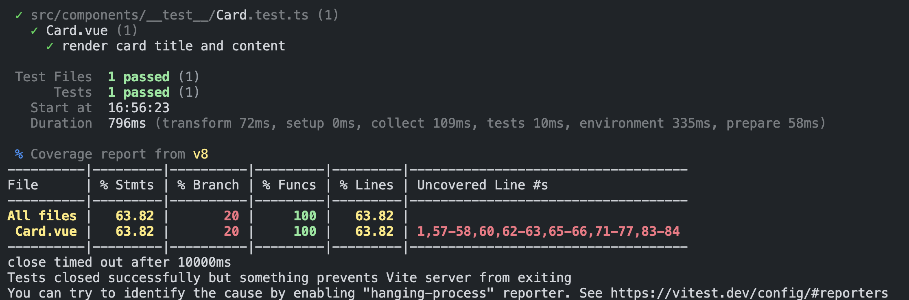
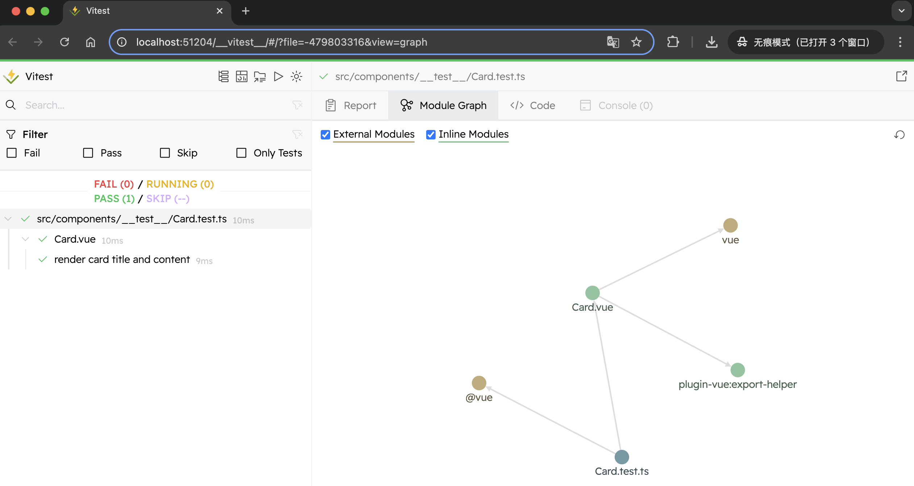
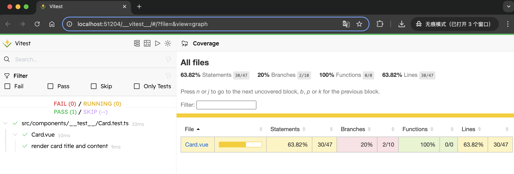

# 配置 单元测试及 e2e 测试

## 前端项目测试

测试的分类：

- 单元测试：单个组件或函数的测试。
- 集成测试：在单元测试之后进行，用于测试组件之间的交互。
- e2e 测试：端到端全面的系统的测试。
- 性能测试：用来确保应用在高负载下也能正常运行。
- 可用性测试：一种用户体验的测试，主要关注应用的易用性。
- 兼容性测试：确保应用在各种设备和浏览器都能正常运行。

测试考量维度：全面。持续。自动化。

单元测试工具：`Vitest`、`Jest`、`Mocha`。

e2e 测试工具：`Cypress`、`Nightwatch`。

## 单元测试-Vitest

**安装配置:**

[`Vitest`](https://cn.vitest.dev/guide/why.html) 旨在将自己定位为 `Vite` 项目的首选测试框架。

`Vitest` 它是兼容 `Jest`的，同时和 `vite` 是天生一对。`Vitest` 在复用 `vite` 的配置、转换器、解析器和插件。这样就不需要我们重复的配置。

`Vitest` 的主要优势之一是它与 `Vite` 的统一配置。如果存在，`vitest` 将读取你的根目录 `vite.config.ts` 以匹配插件并设置为你的 `Vite` 应用。

否则手动安装并创建 `vitest.config.ts`。

```bash
pnpm add -D vitest
```

::: code-group

```ts{10} [vitest.config.ts]
import { fileURLToPath } from 'node:url'
import { mergeConfig, defineConfig, configDefaults } from 'vitest/config'
import viteConfig from './vite.config'

export default mergeConfig(
  viteConfig,
  defineConfig({
    test: {
      environment: 'jsdom',
      exclude: [...configDefaults.exclude, 'cypress/**'],
      root: fileURLToPath(new URL('./', import.meta.url)),
    },
  }),
)

```

:::

**测试覆盖率:**

`Vitest` 通过 `v8` 支持原生代码覆盖率，通过 `istanbul` 支持检测代码覆盖率。[📖](https://cn.vitest.dev/guide/coverage.html)

::: tip
要查看有关覆盖率的所有可配置选项，请参见 [覆盖率配置参考](https://cn.vitest.dev/config/#coverage)。

建议始终在配置文件中定义 [`coverage.include`](https://cn.vitest.dev/config/#coverage-include)。 这有助于 `Vitest` 减少 [`coverage.all`](https://cn.vitest.dev/config/#coverage-all) 选择的文件数量。
:::

::: code-group

```ts{13-19} [vitest.config.ts]
import { fileURLToPath } from 'node:url'
import { mergeConfig, defineConfig, configDefaults } from 'vitest/config'
import viteConfig from './vite.config'
import path from 'path'

export default mergeConfig(
  viteConfig,
  defineConfig({
    test: {
      environment: 'jsdom',
      exclude: [...configDefaults.exclude, 'cypress/**'],
      root: fileURLToPath(new URL('./', import.meta.url)),
      // [!code focus:7]
      coverage: {
        provider: 'v8', // or 'istanbul'
        reporter: ['text', 'json', 'html'],
        all: false,
        // enabled: true, // 使用 vitest-ui 的 coverage
      },
    },
  }),
)

```

:::

**在 `package.json` 中添加测试命令:**

**在 `CLI` 中传递 `--coverage` 标志:**

::: code-group

```json{2,3} [package.json]
  "scripts": {
    "test:unit": "vitest",
    "test:coverage": "vitest run --coverage", // 测试覆盖率
  }
```

:::

**创建测试文件 `__test__` 测试 `Card.vue` 组件：**

```bash
mkdir src/components/__test__
```

::: code-group

```ts [src/components/__test__/Card.test.ts]
import { describe, it, expect, beforeEach } from "vitest";
import { shallowMount } from "@vue/test-utils";

import Card from "@/components/Card.vue";

describe("Card.vue", () => {
  it("render card title and content", () => {
    const wrapper = shallowMount(Card, {
      propsData: { title: "title", subTitle: "subTitle" },
    });
    expect(wrapper.text()).toMatch("title");
    expect(wrapper.text()).toMatch("subTitle");
  });
});
```

:::

**测试覆盖率：**

```bash
pnpm test:coverage
```

| File     | %Stmts     | %Branch        | %Funcs     | %Lines   | Uncovered Line #s |
| -------- | ---------- | -------------- | ---------- | -------- | ----------------- |
| 测试文件 | 语句覆盖率 | 分支语句覆盖率 | 函数覆盖率 | 执行比列 | 没有覆盖到的行    |



**可以在 [Vitest UI](https://cn.vitest.dev/guide/ui.html) 中查看你的覆盖率报告。 一个漂亮的 `UI` 界面来查看并与测试交互:**




## 端到端测试-Cypress

端到端测试`（E2E，End-to-End Testing）`是一种全面的测试方法，旨在验证整个应用程序从用户界面到后端服务的工作流程。`E2E` 测试模拟用户实际操作场景，以确保应用在真实环境中的运行效果。

> - 目标：确保应用程序的各个部分（前端、后端、数据库、API）无缝协作。
> - 测试范围：从用户输入到系统输出，覆盖整个业务流程。

**E2E 测试与单元测试的区别:**

| **维度**         | **单元测试**                     | **端到端测试 (E2E)**                             |
| ---------------- | -------------------------------- | ------------------------------------------------ |
| **测试范围**     | 仅限于单个组件或函数             | 涵盖整个系统工作流程                             |
| **测试目的**     | 验证代码的功能是否符合预期       | 确保系统的业务逻辑、界面和服务协作良好           |
| **执行速度**     | 快速，适合频繁运行               | 较慢，因为涉及更多的依赖（如浏览器、后端服务等） |
| **失败原因定位** | 更容易，因为测试是针对单个功能的 | 较难，因为问题可能出现在任何子系统或交互环节     |
| **测试环境**     | 隔离的开发环境（Mock 数据）      | 真实环境，或接近真实用户场景                     |

**安装 cypress:**

```bash
pnpm add -D cypress # 安装
```

**在 `package.json` 中添加命令:**

::: code-group

```json{2,3} [package.json]
  "scripts": {
    "test:e2e": "start-server-and-test preview http://localhost:4173 'cypress run --e2e'",
    "test:e2e:dev": "start-server-and-test 'vite dev --port 4173' http://localhost:4173 'cypress open --e2e'",
  }
```

:::

**测试一个简单的登录页面:**

::: code-group

```ts [cypress/e2e/login.cy.ts]
describe("Login Page E2E Test", () => {
  beforeEach(() => {
    // 每次测试前访问登录页面
    cy.visit("http://localhost:3000/login");
  });

  it("should render login form", () => {
    // 检查页面是否渲染了用户名和密码输入框
    cy.get('input[name="username"]').should("be.visible");
    cy.get('input[name="password"]').should("be.visible");
    cy.get('button[type="submit"]').should("contain", "Login");
  });

  it("should login successfully with valid credentials", () => {
    // 输入用户名和密码
    cy.get('input[name="username"]').type("testuser");
    cy.get('input[name="password"]').type("testpassword");
    // 点击登录按钮
    cy.get('button[type="submit"]').click();
    // 验证登录成功后页面跳转
    cy.url().should("include", "/dashboard");
    cy.get(".welcome-message").should("contain", "Welcome, testuser");
  });

  it("should show error message for invalid credentials", () => {
    cy.get('input[name="username"]').type("wronguser");
    cy.get('input[name="password"]').type("wrongpassword");
    cy.get('button[type="submit"]').click();
    cy.get(".error-message").should("contain", "Invalid username or password");
  });
});
```

:::

> 测试的最终目标是持续交付高质量的软件产品，希望我们能将测试实践融入到日常开发中，在开发效率和代码稳定性之间找到最佳平衡点！
