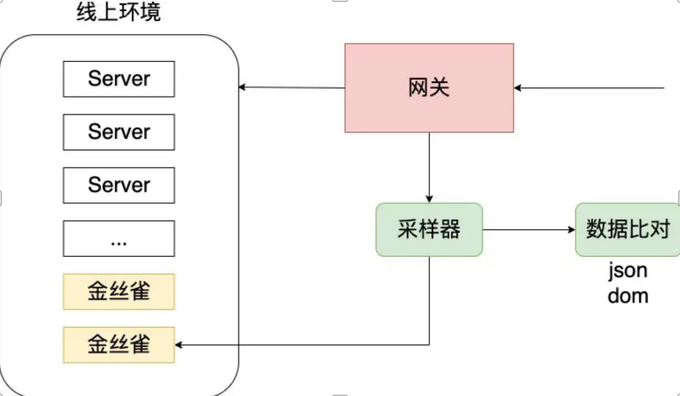

# 工作流 - 技术栈更新与维护方案

> 在实现了初始技术选型并投入开发后，一个重要的持续性任务是更新和维护你的技术栈。这些更新 可以提供新的功能、提升性能、修复漏洞，维护则保证了代码质量和系统稳定性。

## 基本步骤

以下是可参考的基本工作流：

::: info 1. 监测和评估更新

订阅并跟踪你所使用技术栈的更新通知。例如，对于 JavaScript 库或框架，可以在 GitHub 上关注其发布页面，或是订阅相关的 RSSfeed 或邮件通知。

对每个更新进行评估。看看它是否提供了对你的项目有用的新功能，是否修复了你正在经历的问题，或者是否包含了安全更新。

:::

::: info 2. 测试新版本

在决定更新之前，首先在开发环境中测试新版本。看是否与你的代码库兼容，是否引入了新的问题。

使用自动化测试，如单元测试和集成测试，来验证新版本的稳定性和兼容性。

:::

::: info 3. 实施更新：

在确认新版本稳定并且有益于你的项目之后，开始在生产环境中实施更新。

你可能需要调整你的代码以适应新版本，比如 API 变更或者新的最佳实践。

:::

::: info 4. 代码维护：

定期审查和重构代码，保持代码质量。移除无用依赖，修复已知的问题，提升代码可读性和可维护性。

使用静态代码分析工具（如 ESLint 对于 JavaScript）来检测可能的错误和不良的编程实践。

:::

::: info 5. 检测性能和安全性：

定期监测应用的性能和安全性。使用性能分析工具（如 GoogleLighthouse）来评估你的前端性能。

对于安全性，确保在接收并及时处理所有的安全更新，并使用安全检查工具（如 OWASPZAP）进行定期的安全扫描。

:::

::: info 6. 分享和培训：

在更新技术栈后，可能需要进行一些内部培训，确保所有团队成员都理解新的功能或者变更。

创建一个内部知识库或者文档，记录关键的更新和最佳实践。

:::

## 灰度发布

> 灰度发布是一种软件发布管理策略，它允许开发者逐渐推出新特性、更新或修改，只对部分用户生效，而不是一次性推向全部用户。这样可以在较小的用户群体中验证功能的稳定性和效用，同时降低因发布新功能或更新带来的风险。如果灰度发布中出现问题，可以在影响扩大之前快速回滚。

> 在技术栈更新与维护的过程中，灰度发布是一个非常有用的策略。例如，如果你在更新一个关键的依赖库或框架，你可以先在一部分用户（或服务）中进行灰度发布，观察是否存在任何未预期的问题或副作用。一旦确认新版本稳定，再逐步推向所有用户或服务。

> 在 PC 网页、移动端和桌面应用程序中进行灰度发布都有一些常见的策略。

## 前端灰度发布策略

> 在前端领域中，实现灰度发布的方法有很多种。灰度发布的主要目标是将新版本的应用逐步推出，以便在有限的用户群体中测试其性能和可靠性，然后再全面推出。

下面是一些在前端实现灰度发布的常见方案。具体选哪一种方案，取决于应用的特性和需求：

1. 特性切换（FeatureToggles）：通过在代码中添加开关，可以在运行时动态地开启或关闭某个新的特性或修改。特性切换可以根据用户的标识，地理位置，浏览器类型等进行调整，以实现灰度发布。
2. A/B 测试：A/B 测试是一种统计学方法，通过将用户群体分成两组（或多组）并给予不同的体验，然后比较这些群体的行为差异。许多 A/B 测试平台，如 Optimizely、Firebase 等，支持灰度发布。

3. CanaryReleases：该方法涉及将新版本部署到所谓的"金丝雀"服务器，并将一小部分用户流量引导至该服务器。如果没有发现问题，则可以将新版本部署到所有服务器。

<br />



<br />

4. 使用 CDN 的 Edges：一些 CDN 提供商（如 Akamai、Fastly、Cloudflare、Deno）提供了在边缘节点上执行代码的能力，这可以用来实现灰度发布。例如，你可以在边缘节点上根据用户的 IP 地址或 cookie，选择性地返回新版本或旧版本的资源。

5. 使用 ServiceWorkers：在支持 SeπrviceWorkers 的浏览器中，你可以在 ServiceWorker 中实现灰度发布。例如，你可以根据用户的 ID 或其他标识，选择性地缓存并返回新版本或旧版本的资源。

6. 使用前端路由：在单页应用（SPA）中，你可以使用前端路由来实现灰度发布。例如，你可以创建一个新的路由对应新的特性，然后根据用户的标识选择性地展示这个路由。

## 网页应用

> 一般来说，灰度发布需要与你的发布系统和应用架构紧密配合。以下是一些常见的策略：

1. 使用反向代理或负载均衡器：例如，你可以配置 Nginx 或 HAProxy 等工具，根据用户的 IP 地址或其他标识，将部分用户的请求路由到运行新版本的服务器，而其他用户则仍然访问旧版本。这种方法适用于无状态的服务，例如静态网页或 RESTAPI。

2. 使用特性切换：你可以在代码中加入特性切换（FeatureToggles），在运行时动态开启或关闭某个新的特性或修改。这通常需要一个配置服务或数据库，以存储不同用户的特性开关状态。然后，你可以在后端或前端根据用户的标识，动态调整这些特性开关。

3. 使用 A/B 测试平台：有一些专门的 A/B 测试平台，如 Optimizely、Firebase 等，可以帮助你进行灰度发布。你可以在这些平台上定义实验群组和控制群组，然后将新的特性或修改只推送到实验群组。

## 移动端和桌面应用

> 对于需要打包的应用，如移动端和桌面应用，通常需要应用市场或分发平台的支持。例如 GooglePlayStore 和 AppleAppStore 都支持阶段性发布，你可以设定只向一部分用户推送新的更新。
>
> 对于桌面应用，例如，如果你使用了 Electron，可以使用 electron-builder 的 autoUpdater 模块实现灰度发布。

假设你正在开发一个电子商务网站，现在要添加一个新的推荐算法。以下是一个使用特性切换的案例。通过这种方法，你可以在控制风险的同时，逐步推出新的特性或修改：

1. 在代码中添加特性切换，可以用一个环境变量或配置文件来控制是否使用新的推荐算法。

2. 在开发和测试环境中，你可以开启新的推荐算法，进行详尽的测试。

3. 当你准备在生产环境中进行灰度发布时，首先只向一部分用户开启新的推荐算法。这可以通过在后端根据用户 ID 或其他标识，动态调整特性切换的状态。

4. 持续收集和分析用户反馈和性能数据。如果发现任何问题，可以快速关闭新的推荐算法，回滚到旧的版本。

5. 一旦确认新的推荐算法稳定且效果良好，可以逐步向所有用户推送。

## 前端灰度发布案例

> 对于前端依赖库（如 npm 包）的更新，灰度发布的概念有所不同。因为你不能对一部分用户提供一个版本的依赖库，对其他用户提供另一个版本的依赖库，这是由于当你发布你的前端应用时，所有的依赖库都已经打包在一起，无法动态更改。

你可以采用类似的策略，通过一系列测试和逐步推出来降低风险。以下是一种可能的工作流：

1. 监控和评估依赖库的更新：你可以使用 npm 的 npmoutdated 命令，或者一些第三方服务（如 Dependabot）来监控你的依赖库的更新。对于每个更新，你需要评估它是否有利于你的项目，比如是否提供了新的功能，修复了错误，或者增加了性能。

2. 在开发环境中测试新版本：在你的开发环境中，安装新版本的依赖库，并运行你的应用。这时，你可以查看新版本是否与你的代码兼容，是否引入了新的问题。

3. 在 CI/CD 流程中进行全面测试：在你的 CI/CD 流程中，对新版本的依赖库进行全面的自动化测试，包括单元测试、集成测试和端到端测试。这可以帮助你发现可能的问题。

4. 在预生产环境中进行灰度发布：在预生产环境（如 staging 或 QA 环境）中发布包含新版本依赖库的应用。这样，你可以在一个接近真实环境的地方进行测试。

5. 在生产环境中进行逐步发布：一旦你确认新版本的依赖库在预生产环境中稳定，你可以在生产环境中进行逐步发布。这可以通过使用反向代理或负载均衡器，将部分用户的请求路由到包含新版本依赖库的服务器。

> 这个过程允许你在每个步骤中检查新版本的依赖库，以确保它不会引入新的问题。如果在任何步骤中发现问题，你可以回滚到旧的版本，然后修复问题或等待依赖库的维护者修复问题。

## 案例

如何配置 nginx 代理到一台服务器 80%的流量，另外一台 20%的流量，这种如何配置，如何实现？

```json
worker_processes 1;

events {
  worker_connections 1024;
}

http {
  upstream backend {
    # 旧版本应用的服务器和端口
    server 127.0.0.1:3000 weight=4;
    # 新版本应用的服务器和端口
    server 1270.0.1:3001 weight=1;
  }

  server {
    listen 80;
    server_name site1.com;

    location / {
      proxy_pass http://backend;
    }
  }
}
```

前端服务：

```json
{
  "name": "nginx",
  "version": "1.0.0",
  "description": "",
  "main": "index.js",
  "type": "module",
  "scripts": {
    "start": "run-p server server1",
    "server": "json-server --watch db.json --static ./site1 --port 3000",
    "server1": "json-server --watch db.json --static ./site2 --port 3001"
  },
  "keywords": [],
  "author": "",
  "license": "ISC",
  "dependencies": {
    "json-server": "^0.17.3"
  }
}
```

运行 Nginx:

```yaml
version: "3"
services:
  nginx:
    container_name: nginx
    image: nginx:latest
    network_mode: host
    volumes:
      - ./nginx.conf:/etc/nginx/nginx.conf #宿主机文件已创建
    restart: always
```
