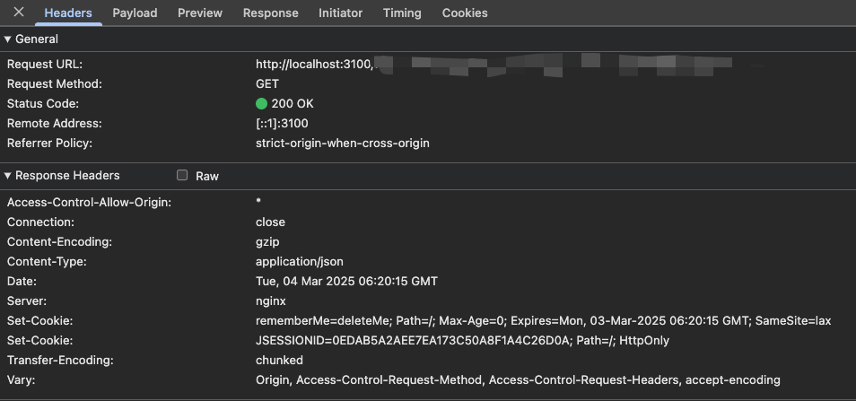
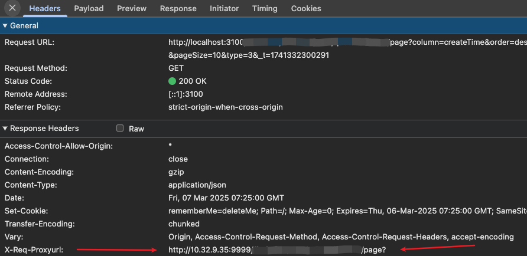

# Vite 设置 Proxy 后 Network 中没有代理后的 URL

接手到了一个 vite 工程的项目，启动开发环境后在调试过程中，我想看到真实的接口服务器 IP。

发现 chrome 中的 Network 查看不到代理后的服务器的真实 URL。只有代理前的 URL。

我一直习惯在 Network 中查看，可以第一时间确定 代理的地址是否正确。



`proxy` 中配置 `bypass` 函数，获取代理结果，设置响应头:

::: code-group

```js
 bypass: function (req, res, options) {
  // 设置代理转发前缀
  const proxyUrl = new URL(options.rewrite(req.url) || '', options.target)?.href || '';
  res.setHeader('x-req-proxyUrl', proxyUrl);
}
```

:::


