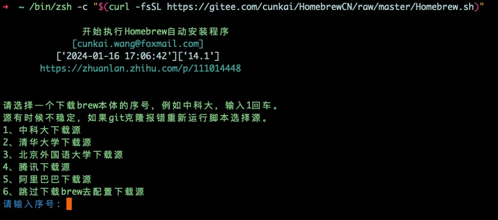
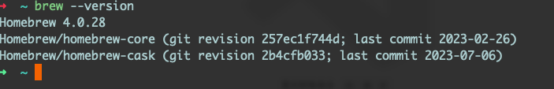

# Homebrew：MacOS 上的软件包管理

[Homebrew](https://brew.sh/) 是一款强大的开源软件包管理器。

它的存在填补了 macOS 原生缺少的软件包管理工具，使得在 Mac 上安装、升级和管理软件包变得更加轻松和便捷。

## Homebrew 使用场景

比如在`MacOS`中安装`redis`，使用`Homebrew`可以减少大量的安装和配置的工作量。

#### 安装 redis

```bash
brew install redis
```

#### 修改配置文件

```bash
vim /usr/local/etc/redis.conf
```

#### 启动 Redis 服务

```bash
brew services start redis
# or
redis-server /usr/local/etc/redis.conf
```

#### 停止 Redis 服务

```bash
brew services stop redis
```

#### 重启 Redis 服务

```bash
brew services restart redis
```

## MacOS 安装 Homebrew

在[Homebrew](https://brew.sh/)官网中，已经给出了安装命令；(当然需要魔法)。

#### 无魔法安装

使用国内镜像的自动安装脚本（`gitee`某开发者开源安装脚本）

```bash
/bin/zsh -c "$(curl -fsSL https://gitee.com/cunkai/HomebrewCN/raw/master/Homebrew.sh)
```

#### 选择镜像源

如果存在旧版本，会弹出删除旧版本提示，输入"Y"，回车。



#### 无 Git 环境配置

如果你的电脑环境中没有配置 `git`，会停止 `Homebrew` 的安装，请先安装 `git`

- 一般情况会 弹出安装 `git` 的提示，点击安装即可.

- 安装完成 `git` 后，再次执行 `Homebrew` 安装指令，直到安装完成。


#### 安装完成

使用 `brew --version` 看到版本信息。



#### 卸载 Homebrew

```bash
/bin/zsh -c "$(curl -fsSL https://gitee.com/cunkai/HomebrewCN/raw/master/HomebrewUninstall.sh)"
```

## 让 Homebrew 加速起飞

使用 `brew` 的速度是真的感人，以下有两个办法加速。

#### 1. 修改镜像源

- 修改镜像源为 清华镜像源:

```bash
git -C "$(brew --repo)" remote set-url origin https://mirrors.tuna.tsinghua.edu.cn/git/homebrew/brew.git

git -C "$(brew --repo homebrew/core)" remote set-url origin https://mirrors.tuna.tsinghua.edu.cn/git/homebrew/homebrew-core.git

git -C "$(brew --repo homebrew/cask)" remote set-url origin https://mirrors.tuna.tsinghua.edu.cn/git/homebrew/homebrew-cask.git
```

- 如果你还想还原为 Github:

```bash
git -C "$(brew --repo)" remote set-url origin https://github.com/Homebrew/brew.git

git -C "$(brew --repo homebrew/core)" remote set-url origin https://github.com/Homebrew/homebrew-core.git

git -C "$(brew --repo homebrew/cask)" remote set-url origin https://github.com/Homebrew/homebrew-cask.git
```

#### 2. 修改 bottles

- 打开你正在使用的 `shell配置文件`，我这里使用的是 `.zshrc`

- 在文件中加入以下变量：

```bash
export HOMEBREW_BOTTLE_DOMAIN=https://mirrors.tuna.tsinghua.edu.cn/homebrew-bottles
# 重载 zshrc
source ~/.zshrc
```

## Homebrew 常用命令

#### 安装软件

```bash
# 查找包
brew search name
# 安装默认最新版
brew install name
# 安装指定版本
brew install name@版本号
```

#### 更新软件

```bash
# 指定包名卸载
brew upgrade name
# 更新 brew 所有包
brew upgrade
```

#### 卸载软件

```bash
# 指定包名卸载
brew uninstall name
```

#### 服务相关

```bash
# 获取services列表
brew services list 
brew services start/stop/restart serverName
# 启动mysql服务
brew services start mysql 
# 重启mysql服务
brew services restart mysql
# 停止mysql服务
brew services stop mysql
```

#### 更多常用命令

```bash
# 查看已安装软件
brew list
# 查看已安装软件版本号
brew list --versions
# 查看brew配置
brew config 
# 查看mysql安装信息
brew info mysql
# 清除下载的缓存
brew cleanup 
```
